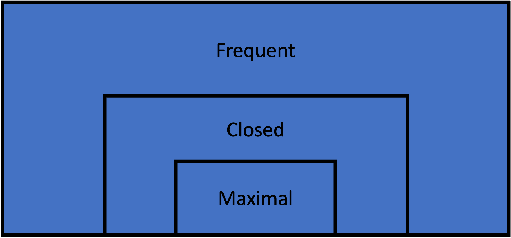

# Frequent Itemset Mining


## Description

Frequent itemset mining is a fundamental technique in data mining focused on discovering itemsets that appear frequently in a transactional dataset. A frequent itemset is a set of items that occurs together in the data with a frequency no less than a specified minimum support threshold. Frequent itemsets form the basis of various data mining tasks, including association rule mining, sequential pattern mining, and correlation analysis.

The one caveat with frequent itemset mining is that depending on the support parameter and the structure of the data, these mining techniques can yield large numbers of patterns, especially in dense datasets or with low support thresholds. This challenge has led to the development of more concise representations like closed and maximal itemset mining.

## Formal Definition
Let:
- ``I`` be the set of all items in the dataset
- ``X`` be an itemset, where ``X \subseteq I``
- ``D`` be the set of all transactions in the dataset
- ``\sigma(X)`` be the support of itemset ``X`` in ``D``
- ``\sigma_{min}`` be the minimum support threshold

Then, an itemset ``X`` is a maximal frequent itemset if and only if:
1.	The support of ``X`` is greater than or equal to the minimum support threshold: 
```math
\sigma(X) \geq \sigma_{min}
```


Thus, ``FI``, the set of all maximal frequent itemsets in ``I`` can be expressed as:

```math
FI = {X \mid X \subseteq I \wedge \sigma(X) \geq \sigma_{min}}
```

## Algorithms

### ECLAT

The `eclat` function implements the [E]quivalence [CLA]ss [T]ransformation algorithm for frequent itemset mining proposed by Mohammad Zaki in 2000. This algorithm identifies frequent itemsets in a dataset utilizing a column-first search and supplied minimum support.

```@docs
eclat(txns::Transactions, min_support::Union{Int,Float64})
```

### FP-Growth

The `fpgrowth` function implements the FP-Growth ([F]requent [P]attern Growth) algorithm for mining frequent itemsets. This algorithm, proposed by Han et al. in 2000, is an efficient method for discovering frequent itemsets in a dataset without candidate generation. It is generally more efficient than other algorithms when datasets are dense, as the internal FP tree data structure it builds efficiently summarizes the relationships and supports of the itemsets.

```@docs
fpgrowth(txns::Transactions, min_support::Union{Int,Float64})
```