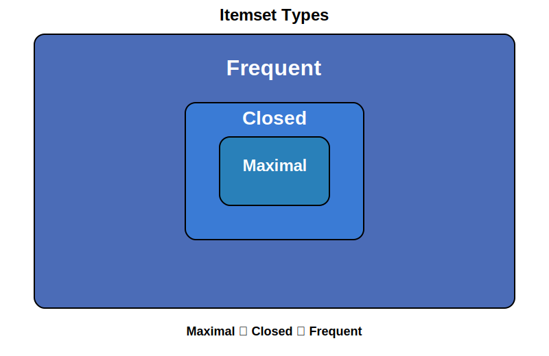

# Itemset Mining {#Itemset-Mining}

## Overview {#Overview}

Itemset mining is a fundamental technique in data mining focused on discovering sets of items that appear together in transaction data. These patterns provide valuable insights for various applications including market basket analysis, recommendation systems, and anomaly detection.

There are three main types of itemset mining, which form a hierarchy of increasingly concise representations:





## Frequent Itemsets {#Frequent-Itemsets}

### Description {#Description}

Frequent itemset mining is the foundation of pattern discovery in transaction data. A frequent itemset is a set of items that occurs together in the data with a frequency no less than a specified minimum support threshold. 

The main challenge with frequent itemset mining is that it can yield extremely large numbers of patterns, especially in dense datasets or with low support thresholds. This challenge has led to the development of more concise representations like closed and maximal itemset mining.

### Formal Definition {#Formal-Definition}

Let:
- $I$ be the set of all items in the dataset
  
- $X$ be an itemset, where $X \subseteq I$
  
- $D$ be the set of all transactions in the dataset
  
- $\sigma(X)$ be the support of itemset $X$ in $D$
  
- $\sigma_{min}$ be the minimum support threshold
  

Then, an itemset $X$ is a frequent itemset if and only if:

The support of $X$ is greater than or equal to the minimum support threshold: 

$$\sigma(X) \geq \sigma_{min}$$

Thus, $FI$, the set of all frequent itemsets in $I$ can be expressed as:

$$FI = \{X \mid X \subseteq I \wedge \sigma(X) \geq \sigma_{min}\}$$

## Closed Itemsets {#Closed-Itemsets}

### Description {#Description-2}

Closed itemset mining represents a middle ground between completeness and conciseness. A closed itemset is a frequent itemset that has no superset with exactly the same support. In other words, closed itemsets are the largest possible combinations of items that share the same transactions.

The key advantage of mining closed itemsets is that they provide a lossless compression of all frequent patterns in the data. By identifying only the closed frequent itemsets, the number of patterns generated is significantly reduced compared to mining all frequent itemsets while still retaining all support information. This approach strikes a balance between the compactness of maximal itemsets and the completeness of all frequent itemsets.

### Formal Definition {#Formal-Definition-2}

Let:
- $I$ be the set of all items in the dataset
  
- $X$ be an itemset, where $X \subseteq I$
  
- $D$ be the set of all transactions in the dataset
  
- $\sigma(X)$ be the support of itemset $X$ in $D$
  
- $\sigma_{min}$ be the minimum support threshold
  

Then, an itemset $X$ is a closed frequent itemset if and only if:
1. The support of $X$ is greater than or equal to the minimum support threshold:
  

$$\sigma(X) \geq \sigma_{min}$$
1. There does not exist a proper superset $Y$ of $X$ with the same support: 
  

$$\nexists Y \supset X : \sigma(Y) = \sigma(X)$$

Thus, $CFI$, the set of all closed frequent itemsets in $I$, can be expressed as:

$$CFI = \{X \mid X \subseteq I \wedge \sigma(X) \geq \sigma_{min} \wedge \nexists Y \supset X : \sigma(Y) = \sigma(X)\}$$

## Maximal Itemsets {#Maximal-Itemsets}

### Description {#Description-3}

Maximal itemset mining provides the most compact representation of frequent patterns. A maximal itemset is a frequent itemset that is not a subset of any other frequent itemset. In other words, maximal itemsets are the largest possible frequent combinations of items in the dataset.

The key advantage of mining maximal itemsets is its extreme compression of all frequent patterns. By identifying only the maximal frequent itemsets, the number of patterns generated is dramatically reduced compared to both frequent and closed itemset mining. This approach is particularly valuable when dealing with high-dimensional data or datasets with long transactions.

### Formal Definition {#Formal-Definition-3}

Let:
- $I$ be the set of all items in the dataset
  
- $X$ be an itemset, where $X \subseteq I$
  
- $D$ be the set of all transactions in the dataset
  
- $\sigma(X)$ be the support of itemset $X$ in $D$
  
- $\sigma_{min}$ be the minimum support threshold
  

Then, an itemset $X$ is a maximal frequent itemset if and only if:
1. The support of $X$ is greater than or equal to the minimum support threshold: 
  

$$\sigma(X) \geq \sigma_{min}$$
1. There does not exist a superset $Y$ of $X$ such that $Y$ is also frequent: 
  

$$\nexists Y \supset X : \sigma(Y) \geq \sigma_{min}$$

Thus, $MFI$, the set of all maximal frequent itemsets in $I$ can be expressed as:

$$MFI = \{X \mid X \subseteq I \wedge \sigma(X) \geq \sigma_{min} \wedge \nexists Y \supset X : \sigma(Y) \geq \sigma_{min}\}$$

## Comparison and Trade-offs {#Comparison-and-Trade-offs}

When selecting an itemset mining approach, consider these trade-offs:

|     Type |                                                           Information Preservation |                                         Conciseness |                                                   Use Cases |
| --------:| ----------------------------------------------------------------------------------:| ---------------------------------------------------:| -----------------------------------------------------------:|
| Frequent |                                   Complete (all patterns and their exact supports) |  Lowest (can be exponential in the number of items) |               When complete pattern information is required |
|   Closed |       Lossless compression (can recover all frequent itemsets with exact supports) | Medium (significantly fewer patterns than frequent) | When both pattern completeness and efficiency are important |
|  Maximal | Lossy compression (can recover all frequent itemsets but not their exact supports) |                           Highest (fewest patterns) |          When pattern space exploration is the primary goal |


## Itemset Recovery {#Itemset-Recovery}

RuleMiner provides functions to recover original frequent itemsets from more concise representations:

### From Closed Itemsets {#From-Closed-Itemsets}

Closed itemsets can be used to recover all frequent itemsets along with their exact support values using the `recover_closed` function:

```julia
# Recover all frequent itemsets from closed itemsets
all_itemsets = recover_closed(closed_itemsets_df, min_support)
```


### From Maximal Itemsets {#From-Maximal-Itemsets}

Maximal itemsets can be used to recover all frequent itemsets (without support values) using the `recover_maximal` function:

```julia
# Recover all frequent itemsets from maximal itemsets
all_itemsets = recover_maximal(maximal_itemsets_df)
```


Note that unlike closed itemsets, recovering from maximal itemsets loses the support information of the non-maximal frequent itemsets.
